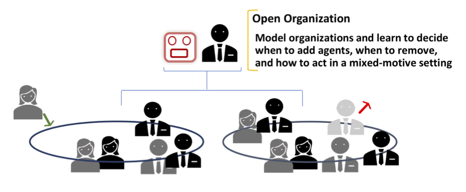

<link type="text/css" rel="stylesheet" href="assets/css/style.css" />

To illustrate how the different types of openness in OASYS manifest, consider the following ... real-world applications:

# Large Organizations

A typical business organization features a mix of (a) cooperation for achieving the overall improvement of the organization and (b) competition among individual employees.  Thus, an employee agent may have two sets of (perhaps conflicting) goals to optimize while contending with other employees.  That is, when an employee is involved in a team project, it needs to balance these (potentially conflicting) goals in order to maximize its expected rewards.

More to follow...
